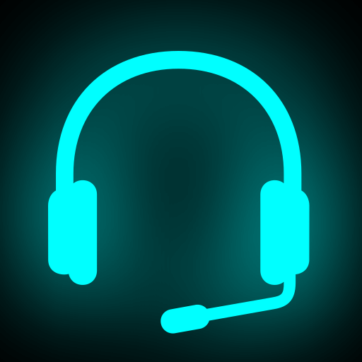

<p align="center">
  
</p>

<h1 align="center">VoiceWrite</h1>

<p align="center">
  <strong>Private, on-device voice-to-text for macOS</strong>
</p>

<p align="center">
  <a href="#features">Features</a> •
  <a href="#requirements">Requirements</a> •
  <a href="#installation">Installation</a> •
  <a href="#usage">Usage</a> •
  <a href="#faq">FAQ</a> •
  <a href="#building">Building</a>
</p>

<p align="center">
  
  
  
  
</p>

<p align="center">
  
</p>

---

## Features

- **Privacy-first** — Uses Apple's on-device SpeechAnalyzer. No cloud, no subscription, no data leaves your Mac.
- **Lightweight** — Under 1MB with no bundled models. Speech models are managed by macOS.
- **Visual feedback** — Screen border glows while recording so you know it's working.
- **Works anywhere** — Global hotkey lets you dictate into any app.
- **Customizable** — Choose border colors and set your preferred keyboard shortcut.
- **Open source** — MIT licensed. Free forever.

## Requirements

- **macOS 26.0 (Tahoe)** or later
- Microphone permission
- Accessibility permission (for typing transcribed text)

## Installation

### Download

1. Download the latest `.dmg` from [Releases](https://github.com/leftouterjoins/voicewrite/releases/latest)
2. Open the DMG and drag VoiceWrite to Applications
3. Launch VoiceWrite from Applications

### Build from Source

See [Building](#building) below.

## Usage

1. **Launch VoiceWrite** — It appears in your menu bar as a microphone icon
2. **Grant permissions** when prompted:
   - **Microphone** — Required for speech recognition
   - **Accessibility** — Required to type text into other apps
3. **Press Ctrl+V** (or your custom hotkey) to start dictating
4. **Speak naturally** — Watch the screen border pulse with your voice
5. **Press Ctrl+V again** to stop and insert the transcription

### Settings

Access settings via the menu bar icon:

| Tab | Options |
|-----|---------|
| **General** | Launch at Login, Border color theme |
| **Hotkey** | Customize the global shortcut |
| **Permissions** | Check and request system permissions |

### Border Colors

Choose from four themes:
- Red/Orange (default)
- Blue/Cyan
- Green/Teal
- Purple/Pink

## Building

### Prerequisites

- macOS 26.0+ with Xcode 16+
- Swift 6.2

### Build Commands

```bash
# Clone the repository
git clone https://github.com/leftouterjoins/voicewrite.git
cd voicewrite

# Build (debug)
make build

# Build release app bundle
make app

# Run the app
make run

# Clean build artifacts
make clean
```

## FAQ

**How is VoiceWrite different from other dictation apps?**

VoiceWrite is designed for quick input — form fields, messages, search queries, and vibe coding. For long-form documents, use macOS's built-in Dictation.

**Why does text get retyped as I speak?**

VoiceWrite shows real-time results by deleting and retyping text as the transcription updates. This works best for short phrases. For longer input, pause briefly to let the transcription stabilize.

**Does it work in Terminal?**

Yes! VoiceWrite uses standard macOS keyboard shortcuts (Ctrl-A, Ctrl-K) that work in Terminal, text editors, and virtually any app.

---

## Privacy

VoiceWrite is designed with privacy as a core principle:

- **100% on-device** — Speech recognition uses Apple's SpeechAnalyzer API
- **No network access** — The app never connects to the internet
- **No analytics** — No tracking, telemetry, or usage data collection
- **Open source** — Audit the code yourself

Read the full [Privacy Policy](https://leftouterjoins.github.io/voicewrite/privacy.html).

## Contributing

Contributions are welcome! Please read [CONTRIBUTING.md](CONTRIBUTING.md) for guidelines.

## License

MIT License — see [LICENSE](LICENSE) for details.

## Acknowledgments

- [KeyboardShortcuts](https://github.com/sindresorhus/KeyboardShortcuts) by @sindresorhus
- Apple's SpeechAnalyzer API
